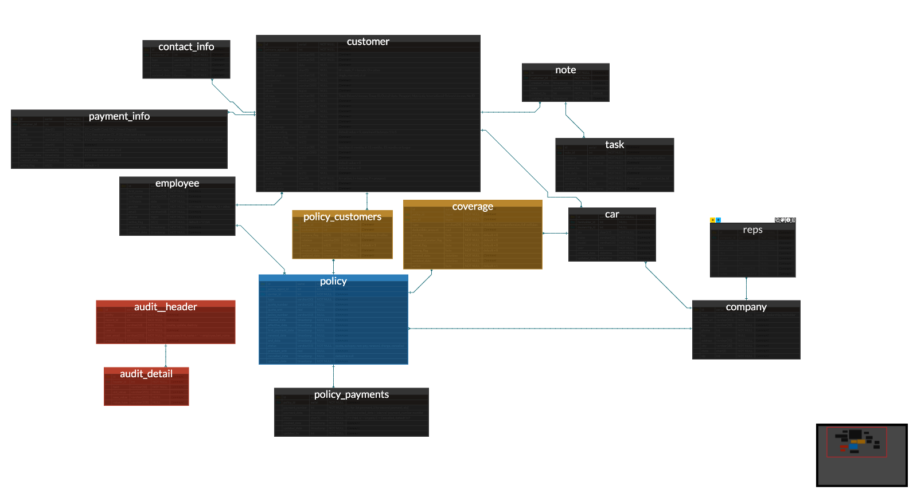

# insurance_crm

## Installation Instructions
This is a CRM aimed at small Personal Auto Insurance agencies. The purpose is to help track customer payments, and notify customers when it's time for their payments or renewals. This CRM can track personal auto polices, the vehicles, coverages, and people associated to each policy.

To install this app you must have pipenv installed and run the following command under the app root directory in shell:

<code>pipenv install</code>

This will install all required python dependencies from the pipfile along with bcrypt. 
You must also run the SQL scripts in order to create the DB and if desired pre-populate with customer/policy data.
Assuming you have postgres installed in your environment, please run the following SQL scripts from the db_scripts folder in shell:

<code>createdb -U postgres Kappa</code>

<code>psql -U postgres -d Kappa -a -f create_scripts_kappa_security.sql</code>

<code>psql -U postgres -d Kappa -a -f create_scripts_kappa_crm.sql</code>

<code>psql -U postgres -d Kappa -a -f insert_scripts_kappa_crm.sql</code>

Once the DB tables have been created a user must be created in order to add additional users.

To run the app, in a shell run:
<code>
pipenv shell python crm.py
</code>

## Database Structure 

Color scheme:
- black: dimension tables
- blue: fact tables
- yellow: bridge tables
- red: audit tables

### Understanding Table Relationships
- Customer can have multiple contact methods - work phone, home phone, work address etc, which is covered in the Contact Info table. 
- Similarly the customer can have several payment methods and notes associated with them. 
- A task can be assigned from a note with due dates. Future scope involves automating reminders.
- The customer table holds primary information about a customer (e.g. birthdate, id information, address information, primary phone, etc) as well as extra flags for potential discounts for quote consideration (e.g. homeowner, currently insured, etc).
- Note versioning will be handled by the audit tables. 
- A customer can be listed on multiple policies and a policy can have multiple customers. To connect customers to policy you must join customer <-> policy_customer <-> policy. The policy_customer table also holds information as to who the primary policyholder is, the relation of the other customers on a policy to the primary policyholder, and the status of a customer on a policy in the event that a customer has been removed mid-policy.
- The policy table holds information about the policy and quote, (e.g. carrier, policy number, effective dates, renewal dates, premium amount, quote amount, etc).
- The status of payments for a policy is held in the policy_payment table. Once a policy is changed from a quote and made active, one record is created per month covered in the policy with a default status of unpaid unless it has been marked paid or cancelled.
- A car can be on multiple policies and a policy can have multiple cars. To connect cars to policy you must join policy <-> coverage <-> car. The coverage table holds information to what type of policy coverage has been extended to each individual car including any additional coverage flags (uninsured motorist, personal injury protection, etc).
- The car table holds information about the car (e.g. make, model, vin, etc.)
- The company table holds contact information about lienholders, dealerships, and carriers. The policy table has a carrier id while the car table holds the lienholder and the dealership ids, all of which relate to the company table. 
- The specific reps for a company are in the rep table and relates to the company.
- The employee table holds information related to agents working at the company. The employee can relate the policy as the agent who created the policy andn can relate to the customer as the customer's primary agent.
- The audit tables populate with any changes made to the tables, i.e. entity and field affected, the type of change made (create, update, destroy), and old/new values for updates/creates.
